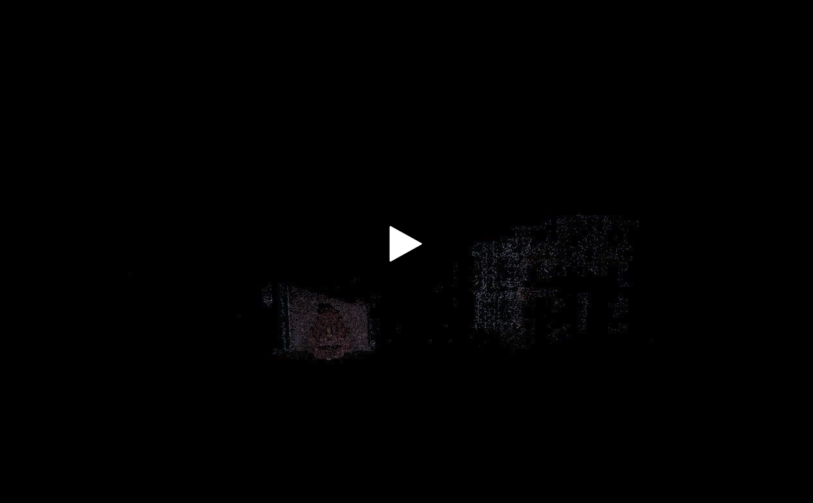

# SfM - Structure from Motion (Incremental) - 3rd Year Project

This repository contains the implementation of:

1. Camera calibration using checkerboard pattern
2. Sparse point cloud generation
   - Feature Detection using: SIFT/SURF/BRISK/KAZE/AKAZE/ORB
   - Feature Matching using: FLANN/BruteForce(BF)
   - Baseline triangulation using homography inliners
   - Bundle Adjustment - CERES solver
3. Dense point cloud generation - PMVS2 (to be added)
4. Visualization - PCL

## References

@article{snavely2008modeling,
title={Modeling the world from internet photo collections},
author={Snavely, Noah and Seitz, Steven M and Szeliski, Richard},
journal={International journal of computer vision},
volume={80},
pages={189--210},
year={2008},
publisher={Springer}
}
